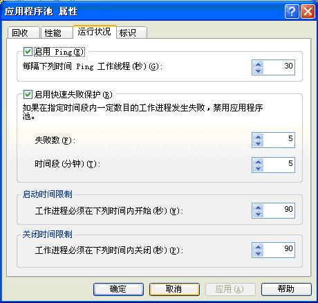
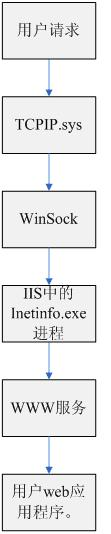
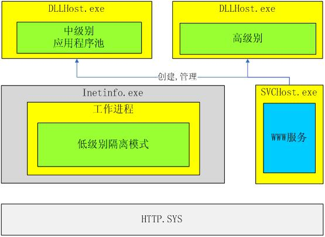
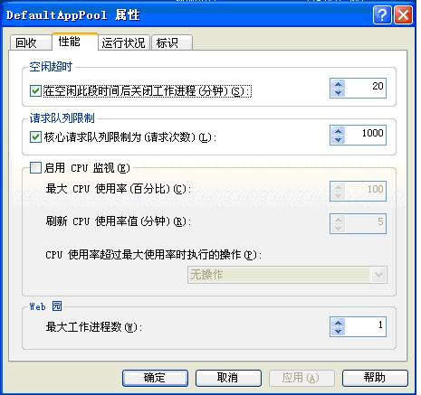

# IIS架构

# 

1. 概述

为了提高IIS的可靠性，安全性以及可用性，与IIS5.0和以前更早的版本不同，IIS6.0提供了一个全新的IIS架构。这个架构的详细情况如下图所示：

 

                                       （图 1） IIS 6.0整体架构由上可以看出，IIS 6.0的内核体系主要由如下三个组件构成：HTTP.SYS，W3SVC以及W3Core。作为一个全新的架构，IIS6.0有如下让人值得关注的新特点：

Ø      HTTP.SYS。全新的内核监听模式。

Ø      IIS6.0新的应用程序隔离模式-工作进程隔离模式。

Ø      应用程序池。

Ø      工作进程。

Ø      Web管理服务（W3SVC）。

作为一个平台，IIS上面运行着很多web应用程序，并且提供了一系列的相关服务。在系统启动阶段，IIS以及IIS所包含的服务的启动过程如下图所示：

           （图 2） IIS的启动过程

# 2.   HTTP.SYS

## 2.1. 概述

HTTP.SYS 运行在windows 的内核模式下，作为驱动程序而存在。它是Windows 2003的TCP/IP网络子系统的一部分，从结构上说，它是TCP之上的一个网络驱动程序，因此，HTTP.SYS不再属于IIS，它已经从IIS中独立了出来。在TCP/IP的基础之上，HTTP.SYS的主要功能是：侦听用户的http请求（这个请求来自于TCPIP.sys驱动程序），并将请求转发给相关的web应用程序处理，最后，HTTP.SYS将处理结果返回给用户（返回到TCPIP.sys驱动程序）。

在HTTP.SYS的内部，它由如下的功能模块组成：

ü    侦听模块。

ü    应答缓存模块。

ü    请求队列。

ü    响应发送模块。

HTTP.SYS的内部组成结构图如下图：  
    

              （图 3）HTTP.SYS的内部结构

## 2.2. HTTP.SYS的可靠性

作为在内核模式下运行的操作系统的驱动程序，HTTP.SYS拥有高度的可靠性和稳定性。它始终处于运行状态，能够对用户的http请求作出快速的响应。

   在内核模式下，HTTP.SYS不执行任何用户代码，它只是监听用户的http请求。这些http请求中包含了IIS上运行的web站点所使用的IP地址和端口。因为在HTTP.SYS中不运行任何的用户代码，所以即使用户的web应用程序发生了故障，也不会影响到HTTP.SYS本身，它仍然能够对用户的http请求进行监听，并及时作出反应。

在IIS 5.0或以前更早的版本中，对用户的http请求进行监听的功能是集成在Inetinfo.exe进程之中的。同时，有一部分用户代码也是运行在Inetinfo.exe进程之中的。在这种情况下，如果用户代码不稳定，或者由于其他原因导致了用户代码的崩溃，那么Inetinfo.exe也会崩溃，这就导致了IIS的不稳定性。

    在IIS 6.0 中，引入了HTTP.SYS模块，它运行在内核模式下，与Inetinfo.exe进程隔离开来，作为操作系统的驱动程序运行。因此，HTTP.SYS不会受到用户代码的影响，它始终处于稳定运行状态，对用户的http请求进行监听，并及时作出反应。IIS 6.0就是通过这种方式保证了它的稳定性和可靠性。

## 2.3. HTTP.SYS对请求的响应过程

HTTP.SYS监听并接收用户的http请求，之后对用户的http请求做出回应。它的具体操作流程如下图所示：  
     

                      （图 4）数据请求  
 首先，用户通过浏览器对部署在IIS中的web应用程序发出http请求。经过各种处理，这个http请求最终会到达TCPIP.SYS驱动程序，TCPIP.SYS将这个请求转发给HTTP.SYS网络驱动程序。在HTTP.SYS中，它的监听模块始终在监听着网络上是否有对它的http请求，当一个http请求到达以后，监听模块会对这个http请求进行分析，并根据请求的类型的不同，将这些请求进行排队，等候应用程序池中的web应用程序对队列中的请求进行处理。

在HTTP.SYS中，它维护着一张数据配置表，在这个表中记录着URL与应用程序池之间的对应关系，HTTP.SYS会对http请求中的URL进行跟踪。也就是说，HTTP.SYS注册了所有IIS 6.0应用，并给每个工作进程赋予一个句柄，IIS内部利用这些句柄来标识、注册应用程序要用到的一个或多个名称空间。因此，当HTTP.SYS接收到一个 HTTP请求的时候，它能够很快地将请求数据包从内核模式下的HTTP.SYS传递到正确的用户模式下的Web应用。

如果在一个http数据请求包到达之后，相关的应用程序池还没有启动，那么HTTP.SYS负责将这个应用程序池启动。这种处理方式也叫做请求式启动。

当一个http请求被处理完毕之后，处理的结果会返回到HTTP.SYS中，由HTTP.SYS中的响应发送模块将这个处理结果返回到TCPIP.SYS中,并最终返回给用户。

## 2.4.HTTP.SYS对数据的缓存

如果用户对web网站上的某部分资源进行频繁的http请求的话，HTTP.SYS会把对这个请求的响应结果进行缓存。当用户下次对这部分资源进行请求的时候，HTTP.SYS会直接把在缓存中保存的响应结果直接发送给用户。从用户发送http请求到系统返回响应结果的这一过程都是HTTP.SYS在内核模式下完成的。不需要在内核模式和用户模式下进行切换，这样就极大地节省了系统资源，提高了请求的响应速度。有关HTTP.SYS数据缓存的过程如下图所示：  
       
                (图 5)HTTP.SYS的缓存处理

## 2.5.HTTP.SYS的配置信息

HTTP.SYS作为网络驱动程序，它已经从IIS中分离了出来，它不再属于IIS的一部分，因此HTTP.SYS的配置数据是存储在注册表中的，而不是IIS的配置数据库中。在注册表中，HTTP.SYS的注册信息位于如下路径下面：

 **HKEY_LOCAL_MACHINE/SYSTEM/CurrentControlSet/Services/HTTP** **。**

## 2.26.HTTP.SYS的其他功能

管理TCP的连接

验证HTTP请求

记录IIS中的Web网站的日志信息

实施带宽限制策略以及支持TCP/IP级的管理

    实现客户证书请求服务

# 3.   W3SVC

## 3.1.概述

   与IIS 5.0不同，W3SVC已经从Inetinfo.exe进程中分离了出来，在IIS中，它将作为一个独立的进程运行。根据配置数据的设置，W3SVC负责创建工作进程(W3Core)。在工作进程的运行过程中，W3SVC还负责监视它的运行状态。

   作为一个独立运行的进程，W3SVC不包含任何第三方用户代码。所以，它不会受到web网站故障的影响，始终处于稳定的运行状态。在此前提下，W3SVC能够稳定地对web网站的运行情况进行监视，并在必要的时候采取行动。基于这一策略，服务器能够根据用户指定的参数监视和重新启动应用程序。

## 3.2.IIS 5.0简介

 在IIS 5.0中，web服务器进程(Inetinfo.exe)负责管理如下四个服务：

Ø      WWW服务

Ø      SMTP服务

Ø      FTP服务

Ø      NNTP服务

   其中，WWW服务负责创建，管理web应用程序的进程。同时，它还负责调度工作，即将用户的http请求转发给web应用程序，当web应用程序对用户的 http请求处理完毕后，WWW服务还负责将处理结果返回给用户。

   在web服务器进程（Inetinfo.exe）中，除了运行上面所说的四个服务外，它还可以运行第三方代码，也就是web应用程序。

   IIS 5.0中，它的架构以及各个进程之间的关系如下图所示：  
  
  (图6)IIS 5.0简单架构图

在IIS 5.0中，它提供了三个不同级别的应用程序保护，他们分别是：

Ø      低级别。IIS进程内，与IIS 1.0、IIS 2.0、IIS 3.0的单一结构一样，web应用程序作为web服务器进程（Intetinfo.exe）的一部分，它在web服务器进程内部运行。这样做的好处是：提高了web应用程序的性能，能够快速的对用户的请求作出响应。但是，同时也降低了IIS的稳定性，一旦web应用程序崩溃，IIS也就同时崩溃了。

Ø      中级别。实现一个单独的缓冲池进程（名为DLLHost.exe的COM+宿主进程），这个缓冲池进程运行在Inetinfo.exe进程之外，多个web应用程序运行在缓冲池进程中。这样就实现了web应用程序与Inetinfo.exe进程的隔离。Web应用程序出现故障也不会影响到Inetinfo.exe进程。在一定程度上保证了IIS的稳定性。但是，在缓冲池进程中，一旦有一个web应用程序崩溃，那么整个缓冲池也就崩溃了，所有运行在缓冲池中的web应用程序都将停止工作。

Ø      高级别。实现一个单独的缓冲池进程（名为DLLHost.exe的COM+宿主进程），这个缓冲池进程运行在Inetinfo.exe进程之外，并且，有且仅有一个web应用程序运行在缓冲池中。这种高级别的保护，在IIS的稳定性方面，要比前两种好的多。一个web应用程序的崩溃不会影响到其他web应用程序和IIS的运行。

   在IIS信息服务管理器中，通过如下方式设置应用程序的保护级别，如下图：  
      
              （图 9）性能配置

*路径：开始菜单-&gt;管理工具-&gt;Internet信息服务管理器-&gt;应用程序池-&gt;属性。*

在这里IIS提供了四种性能监控功能：

ü       对空闲超时的监控。如果工作进程一直处于空闲状态，那么当空闲时间达到设定的值后，W3SVC会关闭工作进程。

ü       请求队列限制。如果用户对工作进程的请求达到设定的上限后，W3SVC将会对用户的请求进行限制。

ü       CPU监视。如果工作进程对CPU的占用率超过设定的上限后，W3SVC会根据IIS的配置信息采取相应的措施。

ü       Web园。关于web园将会在后面的章节详细介绍。

 **3.4.1** **.2应用程序运行状况监控**

在Internet信息服务管理器中，关于应用程序运行状况监控的配置如下图：

        
           （图 10）运行状况配置

*路径：开始菜单-&gt;管理工具-&gt;Internet信息服务管理器-&gt;应用程序池-&gt;属性。*

在这里，IIS对应用程序池运行状况的监控提供了四种功能：

ü       Ping。W3SVC会在设定的时间间隔内对工作线程执行Ping操作，以获取工作线程的状态信息。

ü       快速失败保护。如果在指定的时间段内，一定数目的工作进程发生失败，则W3SVC会禁用应用程序池。

ü       启动时间限制。工作进程必须在设定的时间内开始。

ü      关闭时间限制。工作进程必须在设定的时间内关闭。

### 3.4.2.    应用程序池回收

在Internet信息服务管理器中，关于应用程序池回收的配置如下图：  
   
         （图 11）回收

*路径：开始菜单-&gt;管理工具-&gt;Internet信息服务管理器-&gt;应用程序池-&gt;属性。*

在这里，IIS提供了四种回收的方式：

ü       可以设定回收工作进程的时间间隔。

ü       可以根据对工作进程的请求数量进行回收，一但对工作进程的用户请求数量超过设定值，系统就会执行对应用程序池的回收工作。

ü       定时回收。

ü       根据内存消耗进行回收。

应用程序发生故障，它通知W3SVC执行进程回收工作。  
  
                （图 13）

W3SVC启动一个新的工作进程。旧的工作进程继续执行未完成的用户请求，但不接收新的用户请求。  
        
                    （图 14）

新、旧工作进程之间通信，同步应用程序的状态信息。当新工作进程完全获得了旧工作进程中的应用程序状态信息后，它通知W3SVC，表示它已经准备好了，可以接收用户的http请求。  
      
               （图 15）

旧的进程完成其未决的请求，然后正常关闭，或者如果在达到了配置的时间限制、请求数、设置的时间计划，或当达到指定的内存用量限制后仍没有关闭，则明确地终止进程。新工作进程开始正式工作，接收用户的http请求。

# 4.   W3Core

## 4.1.概述

W3Core又称为工作进程(Worker Process)或W3WP.exe。在默认情况下，IIS 6.0是在工作进程隔离模式下运行的。对于每一个web应用程序，IIS6.0都有一个或多个工作进程实例来运行它。

在W3SVC的管理和监控下，W3Core负责对用户的web应用程序进行管理。它的主要功能是在一个名为W3Core.dll的动态联接库中实现的。在IIS5.0隔离模式下，这个DLL可以被加载到Inetinfo.exe进程中；在应用程序隔离模式下，这个DLL可以被加载到W3WP.exe进程中。

## 4.2.用户web应用程序（web Application）,应用程序池(Application Pools)与工作进程（Worker Process）之间的关系

ü      在IIS6.0中，每一个用户web应用程序都会运行在一个应用程序池中。这个应用程序池可以是IIS默认的应用程序池，也可以是用户自定义的应用程序池。

ü      作为一个宿主程序，每个应用程序池中都会运行着一个或者多个用户web应用程序。

ü      在应用程序池中，存在着一个或者多个工作进程。每个工作进程只能属于一个特定的应用程序池，由这些工作进程来负责管理应用程序池中的用户web应用程序。

他们的结构关系如下图所示：  
        
           （图 16）应用程序池

如果，我们将应用程序池比喻成为一座公寓，那么在公寓里面的那些住户就是一个个web应用程序，而公寓的物业的管理人员就是工作进程。如果公寓比较大，住户比较多，那么就可能需要有多个物业管理人员。也就是说，每个应用程序池里面可以有多个工作进程在工作。

## 4.3.W3Core在IIS安全性方面的考虑

在IIS6.0或更早的版本中，用户的web应用程序是允许运行在进程内的。他们使用系统（System）帐户运行。这个系统帐户是：IWAM_计算机名。因为是在系统帐户下运行，所以这些web应用程序有比较高的权限。

在IIS6.0中，默认情况下，w3wp.exe的所有实例都在一个权限有限的“网络服务”帐户下运行。如下图所示：  
        
                （图 17）网络帐户的配置

当然，用户可以在需要的情况下为W3WP.exe配置新的运行帐户。

这样做的好处是：一旦一个web应用被攻击成功，攻击者只能访问当时运行的工作进程的帐户有权访问的资源，默认的网络服务帐户不能写入Inetpub文件夹，执行权限也极其有限，所以在一定程度上提高了IIS的安全性。

## 4.4.W3Core在IIS性能方面的考虑

在IIS5.0中，由WWW服务负责将用户的http请求转发给web应用程序处理，并负责将web应用程序处理的结果返回给用户。

这一处理的流程如下图所示：

        
     （图18）用户请求的处理过程

在这个过程中，数据需要经过多次传递和转化，这些传递和转换主要包括：

ü       内核模式到用户模式的转化。TCPIP.sys运行在内核模式下，IIS运行在用户模式下。这个转化一项系统开销很大的操作。

ü       IIS负责对用户的http请求进行监听。

ü       用户http请求的需址过程。即，确定由哪个web应用程序来处理用户的请求。这一工作需要IIS来完成。

因此，IIS5.0的这种对用户的http请求的处理过程对IIS的性能有很大的影响。

在IIS6.0中，除了将WWW服务从Inetinfo.exe进程中独立了出来，作为一个单独的组件（W3SVC）来处理外，还将接收用户http请求的功能从W3SVC中分离了出来。接收用户http请求的功能现在由W3Core来实现。W3SVC仅负责对W3Core进行创建和监控，不再负责对用户http请求进行处理。因此，在处理用户的http请求的时候，内核模式下的HTTP.SYS直接监听用户的http请求，并将用户的http请求直接转发给W3Core。并由W3Core所管理的web应用程序来处理用户的http请求。

这一操作过程如下图所示：  
        
                   （图 19）用户请求的处理过程

通过这种方式,IIS6.0中处于内核模式下的HTTP.SYS直接与用户应用程序通信。这就缩短了数据的请求、转发过程，提高了IIS的性能。

# 5.   应用程序池

## 5.1.概述

作为宿主程序，在应用程序池中存在着一个或者多个web应用程序，并且由一个或者多个工作进程来管理这些web应用程序。在W3SVC的监控和管理下，应用程序池主要负责如下四方面的工作。

Ø      回收

Ø      性能

Ø      运行状况

Ø      标识

关于对这四方面的配置，可以在应用程序池的属性页对话框中进行。具体路径如下：**开始菜单-&gt;管理工具-&gt;Internet信息服务管理器-&gt;应用程序池-&gt;属性。**

## 5.2.应用程序池的回收功能

在工作进程隔离模式中，通过配置，IIS可以定期重新启动应用程序池中的工作进程。通过这种机制IIS可以更好地管理那些有错误的工作进程。在默认情况下，当IIS回收一个应用程序池的时候，它会使用一种称为overlapped recycle的回收技术。

在这种回收模式下，失败的工作进程将不会接收新的http请求，当它处理完存储在请求队列中的所有剩余的http请求后，这个进程则正常关闭；或者如果在达到了配置的时间限制、请求数、设置的时间计划，或当达到指定的内存用量限制后仍没有关闭，则明确地终止进程。默认情况下，应用程序池每隔1740分钟（29小时）回收一次。

为了防止服务中断，在失败的工作进程继续处理存储在请求队列中的剩余的请求的时候，IIS启动了新的工作进程，所有新的http请求都会由给这个新的工作进程处理。在此期间，TCP/IP连接不会丢失。

关于应用程序池在他方面的功能在前面的章节中已有详细的介绍，这里就不再过多介绍了。

# 6.   应用程序隔离模式

## 6.1.概述

如果你的服务器是从windows2000升级到windows2003，那么IIS 5.0也会被升级到IIS6.0，这种情况下，IIS是运行在IIS5.0隔离模式下的；如果你的服务器是新安装的windows2003，那么IIS是运行在工作进程隔离模式下的。因此，在IIS6.0中有两种应用程序隔离模式：IIS5隔离模式和工作进程隔离模式。

## 6.2.应用程序隔离的目的

作为一个web应用程序运行的平台，在IIS中将会运行着很多个web应用程序，每个web应用程序的稳定性也各不相同。为了保证IIS的高度稳定性和可靠性，要求在IIS中运行的各个web应用程序彼此相互独立，互不影响。也就是说某一个web应用程序的崩溃不会导致其他web应用程序的崩溃或者整个IIS的崩溃。因此，在IIS中提出了应用程序隔离的概念。

## 6.3.在IIS5.0中的做法

在IIS5.0中，对应用程序的隔离主要有如下几个要点：

Ø       还不存在HTTP.SYS驱动程序，对用户http请求的监听功能由Inetinfo.exe进程实现。

Ø       WWW服务位于Inetinfoexe进程之中。所以WWW服务的稳定性也会影响到整个IIS的稳定性。

Ø       提供了三个不同级别的应用程序保护，即低级别，中级别，高级别。关于应用程序保护级别的详细情况，请见。。。。节。

Ø       存在进程之间互相通信的问题，加大了系统开销。

IIS5.0中，对应用程序进行隔离的结构如下图所示：

  
        （图 20）IIS 5.0的应用程序隔离情况

当一个http请求到底以后，首先由TCPIP.SYS将请求传递给Inetinfo.exe中的WWW服务，然后再由WWW服务转发给DLLHost.exe进程中的web应用程序处理。在这里就存在了一个进程之间通信的问题，必然会引起一些大的系统开销。

WWW服务仅仅负责对DLLHost.exe宿主进程地创建。当这些宿主进程创建完毕后，WWW服务就不会再对它进行管理。

根据应用程序保护级别的不同，web应用程序的隔离程度也各不相同。在低级别的隔离模式中，web应用程序的运行效率最高，但是，由于它直接运行在WWW服务的进程之中，所以它对整个IIS的稳定性的影响也最大。在高级别的隔离模式中，每一个web应用程序都运行于一个属于它的宿主进程（DLLHost.exe）中，虽然这个web应用程序的运行效率降低了，但是，由于它被隔离在一个特定的宿主进程之中运行，所以它对整个IIS系统的稳定性的影响也减小了，一个web应用

程序的崩溃不会影响到其他web应用程序以及整个IIS系统的运行。

## 6.4.IIS5.0隔离模式

在IIS6.0中，为了考虑应用程序的兼容性，因为某些web应用程序可能依赖于IIS5.0的架构。比如，某些Web应用，特别是有些Internet Server API（ISAPI）筛选器，在进程外运行时可能会遇到问题。在IIS 5.0和IIS 4.0中，ISAPI筛选器总是运行在进程Inetinfo.exe之内的，它们的设计目标本来就不是运行在进程之外的，正是由于这些原因，某些筛选器在IIS 6.0的工作进程隔离模式中运行时可能会出现问题。因此，IIS6.0提供了另一种应用程序隔离模式：IIS5.0隔离模式。IIS5.0隔离模式的结构图如下图所示：

        
                    （图 21）IIS5.0隔离模式

在IIS6.0中，IIS5.0隔离模式主要有如下几个要点：

Ø       在内核模式中实现了HTTP.SYS驱动程序，由它负责对http请求的监听。

Ø       WWW服务从Inetinfo.exe进程之中独立了出来。并且由WWW服务负责对宿主进程（DLLHost.exe）的创建和管理。与IIS5.0不同，WWW服务创建了宿主进程DLLHost.exe之后还负责对它进行管理，比如监听它的状态，运行情况等。

Ø       WWW服务负责对http请求进行转发。当用户的http请求从HTTP.SYS驱动程序传递过来以后，由WWW服务负责将这个请求传递个相关的web应用程序处理，并将处理结果返回。

Web应用程序允许运行在Inetinfo.exe进程之中，也可以运行在DLLHost.exe宿主进程之中。

## 6.5.工作进程隔离模式

工作进程隔离模式是IIS6.0所提供的全新的应用程序隔离模式。它的组成结构如下图所示：  
         
                   （图 22）工作进程隔离模式

在IIS6.0中，工作进程隔离模式主要有如下几个要点：

Ø       在内核模式中实现了HTTP.SYS驱动程序，由它负责对http请求的监听。

Ø       WWW服务从Inetinfo.exe进程之中独立了出来，它运行在了新的进程SVCHost.exe之中。

Ø       WWW服务只负责对应用程序池的创建和管理。

Ø       HTTP.SYS驱动程序直接与应用程序池中的工作进程（Worker Process）通信。

Ø       一个应用程序池中可以运行一个或者多个web应用程序，并且由一个或者多个工作进程来管理它们。

Ø       工作进程（Worker Process）之中实现了原来WWW服务的功能：接收HTTP.SYS转发过来的用户http请求。WWW服务将不再负责这部分工作。

# 7.   Web园

在一个应用程序池中存在着一个或者多个web应用程序，并且由这个应用程序池中一个或者多个工作进程来管理这些web应用程序。如果在一个应用程序池中存在着多个工作进程的话，那么就形成了一个web园（Web Gardens）。

关于Web园的配置，如下图所示，只需要将“最大工作进程数”的值设置为大于1的值就可以了。

          
                  （图 23）配置Web园

这样做的好处是：提高了处理用户http请求的效率；当一个工作进程坏掉之后，其他的工作进程仍然能够处理用户的请求，保证了系统的稳定性和可靠性。
