# System.Messaging 命名空间

[MSMQ(消息队列)](https://www.cnblogs.com/shaoshun/p/3800208.html)

前段时间研究WCF接触到了MSMQ，所以认真的学习了一下，下面是我的笔记。

#### 我理解的MSMQ

      MSMQ可以被看成一个数据储存装置，就如同数据库，只不过数据存储的是一条一条的记录，而MSMQ存储的是一个一个的消息(messsge)。Message可以被理解为一种数据容器，我们在稍后会讲到。MSMQ一个重要的应用场景就是离线信息交互，例如，我们在给朋友发送邮件，而此时朋友并未登入邮箱，这个时候我们的邮件就可以发到邮件服务器的MSMQ队列中，当朋友登入邮箱的时候，系统在从服务器的MSMQ队列中取出U件。当然MSMQ的用途远不止这些，例如，充当数据缓存，实现异步操作等等，这里就不在一一举例了。

#### MSMQ的安装

    我们在使用MSMQ的时候需要安装MSMQ，具体步骤请点击 [这里](http://jingyan.baidu.com/album/a17d528538349b8098c8f2ed.html)。当我们正确的安装了MSMQ我们可以在"计算机管理(本地)"找到安装的MSMQ服务，如下图

　　　　

在图上我们可以看见系统的消息队列，为我们提供了3种队列传出队列，专用队列和系统队列，而用户能自由创建的只有专用队列。我们可以尝试创建一个专用队列，"右击"专用队列，再点击"新建"，得到新增界面如下图。由于我们创建的是专用队列，所以在队列命名上面显示的添加"private$",另一个事务复选框表示我们要创建的是队列是否为事务队列，这个在稍后我会详细的解释

 

我在专用队列里面添加一个叫"shaoshun"的专用队列，在专用队列文件夹下面就可以找到，如图

#### 消息

      消息是MSMQ的存储对象，封装为System.Messaging.Message对象，它由一个主体(body)和若干属性构成，其中我们的用户数据通常被序列化装入body主体中，这也是我们称它为数据容器的原因。除了body属性，还有几个属性相对来说比较重要：Priority(消息的优先级)，Label(用户定义的消息标识)，Formatter(消息的序列组件，当用户将复杂类型数据填充到body中，用户的数据会先被序列化)

#### 队列

　　在前面，我们通过手动创建了一个专用队列。我们知道队列分事务性队列和非事务性队列，默认创建的是非事务性队列。当我们勾选事务性复选框，我们就会创建事务性队列，那么什么是事务性队列呢?事务性队列将消息保存在磁盘上，实现了持久化，也就是说当我们关机，断电后，下次再启动机器，我们的消息依然保存在队列里面，而非事务性队列则将消息保存在内存中，也就是说我重启电脑后，队列里面的消息将不存在了。

     队列支持事务操作，当我们把对多个消息的接收操作纳入一个事务中，那么只要有一个消息接收不成功，队列将抛弃前面接收的所有消息，实现事务回滚。队列事务同时支持消息按顺序接收与发送。

#### 尾声

    本文我对MSMQ的相关概念进行了说明，在下一篇，我将通过代码来介绍MSMQ在.net中的常规操作

**如下所示创建一个简单的asp.Net Web应用程序**

                 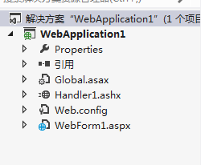

**在VS中生成解决方案之后，可以在项目的目录下看到以下的文件：**

                     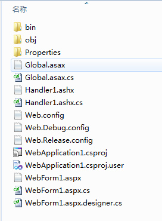

**当我们通过VS将网站发布出去之后，可以看到，最后生成的文件，如下图所示：**

                         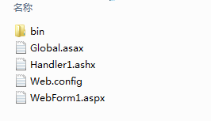

**我们可以发现，发布之后的项目文件夹内少了很多文件，其实这是VS将aspx页面和一般处理程序以及Global文件等的后台文件都编译成了一个dll文件，这个dll文件存放在bin文件夹内：**

                         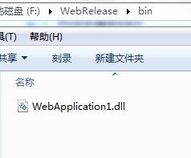

**对这个程序集进行反编译之后，可以看到我们写的后台代码都编译到这个dll文件中了**

                       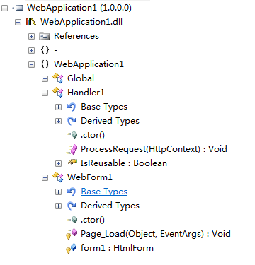

**这个是一般处理程序的ProcessRequest方法中的代码，可以看到就是我们写的源代码：**

                         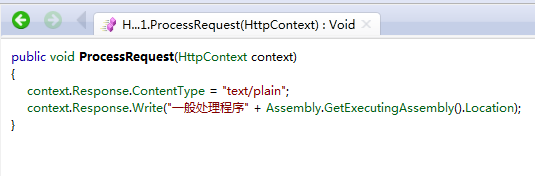

**此时项目文件夹内的几个文件中只剩下一些简单的声明了，所有后台代码都已经不见了：**

**Global文件：**

**一般处理程序：**

**aspx页面：**

**然后我们通过以下这句代码分别获得页面，一般处理程序以及Global编译运行时所在的位置：**

**        System.Reflection.Assembly.GetExecutingAssembly().Location**

**经过对比可以发现Global文件、一般处理程序、aspx后台代码所在的程序集文件为同一个，而aspx前台页面的代码运行在另一个程序集中，以下为运行的结果：**

**Global和aspx页面的前台与后台运行文件：**

**一般处理程序的后台代码：**

**我们可以看到IIS运行网站时，实际将网站编译之后的dll文件都放到了对应的Framework版本中的临时文件夹中了**

**即在C:\Windows\Microsoft.NET\Framework\v4.0.30319\Temporary ASP.NET Files下，网站中自己写的后台代码与类库以及引用的类库都被编译到了这个临时文件夹下当前项目所在的文件夹下的assembly文件下。**

**网站发布后的文件分布图：**

**此时对比发布的网站根目录下的bin文件夹里的dll文件和一般处理程序运行时所在的程序集，可以发现两者是同一个文件：**

         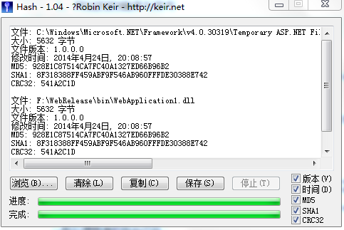

**此时如果删除网站根目录先的bin文件夹内的dll，然后再浏览页面内，可以发现网站无法正常运行：**

        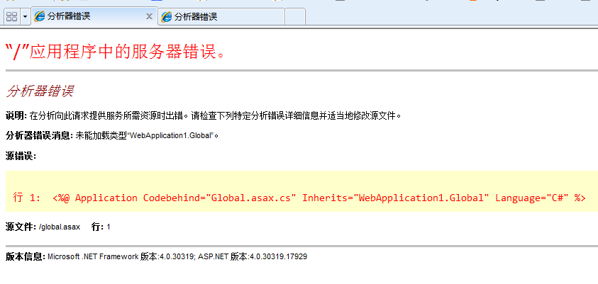

**由上面的结果可以看出，虽然网站中已经存在了一个后台代码的dll文件，但是网站实际运行的是系统文件夹中的那个dll文件，这个应该是直接从网站中拷贝过去的，它们的MD5值完全相同。**

**在这里可以推测，对于asp.Net应用程序来说，IIS只会编译aspx页面，一般处理程序，Global等文件，但是不会编译其他的类文件，所有的类文件对IIS来说没有用处，IIS只能使用编译好的dll文件。**

**当网站正在运行时，无法删除系统文件夹中的那个dll文件，显示被IIS Worker Process占用，这个更加说明网站实际运行时使用的是这个dll文件**

**那么这个IIS Worker Process进程是什么呢，当我们结束当前网站对应的w3wp.exe进程时，系统文件夹中dll被成功删除，这个可以说明，这个dll的调用者正是w3wp.exe这个进行，也说明了w3wp.exe是网站的工作进程。**

**当我们删除系统文件夹中的dll文件时，再次访问网站时会重新在系统文件夹中再次生成dll文件，而且第一次访问时候报错：**

                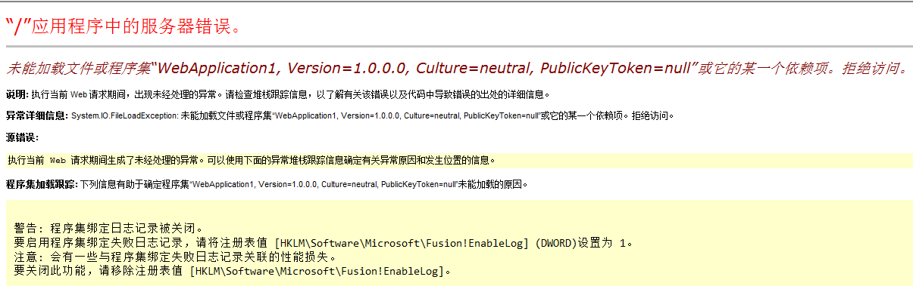

**再次访问就正常了**

 

**总结：**

**所以可以总结出，在IIS中运行asp.Net应用程序时，前台页面的代码是即时进行更新和编译的，当我们修改前台代码时，不需要重新编译项目或者重新发布网站，在访问网站时，IIS（或者.Net框架？）检测到页面发生了修改会帮我们重新编译页面，而在修改了后台代码和其他的类文件的时候就需要我们手动对源代码进行重新编译了。**

---

---

***以上的内容都是针对Asp.Net应用程序来说的***

**对于Asp.Net网站来说发布网站时不会将页面和一般处理程序以及其他一些代码编译成dll文件，只会将源文件和引用的一些类库拷贝到网站的目录下，对于解决方案中的其他类库，也会在编译好之后再拷贝到Bin文件夹中。**

**在这里可以推测，在asp.Net网站中，IIS或者其他的程序，在有人第一次访问网站时，将App_Code文件里的源代码编译成了dll程序集**

                 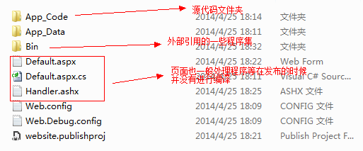

**当用户第一次请求时才进行即时编译，编译好的文件也是存在于系统文件夹下**

**如：C:\Windows\Microsoft.NET\Framework\v4.0.30319\Temporary ASP.NET Files\root\7812c4be\73872874**

**此时生成的文件有以下这些：**

                     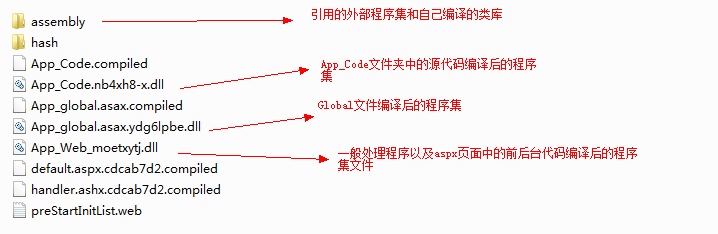

**直接在VS中调试时，情况与上述在IIS中运行类似，只是最后所在的文件目录有所不同，而且会生成很多调试用的文件：**

**C:\Windows\Microsoft.NET\Framework\v2.0.50727\Temporary ASP.NET Files\website1\0e58724c\a4f149c8**

             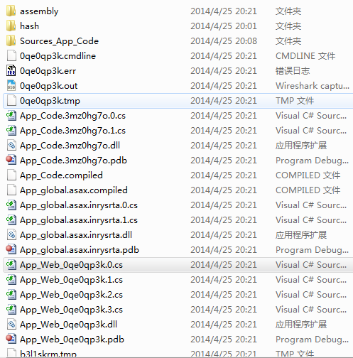

**总结：**

**         Web应用程序和Web网站的前台页面的代码都是在网站运行时，被初次访问时进行编译的，而对于后台代码和网站中的一些类文件来说，Web网站也会在网站第一次被访问的时候被编译，所以，Web网站中的后台代码更改后不需要手动进行编译，而在Web应用程序中，后台代码和类文件都会在发布的时候进行编译，编译成功才能够正常发布，所以对于Web应用程序，修改了后台代码就必须重新编译然后发布。**

**注：网站编译的临时目录可以在IIS中或者Web.config配置文件中进行配置，一下是IIS中的修改方法：**

**在服务器级或者网站级的&quot;.Net编译&quot;选项中修改编译的临时目录，默认情况下临时目录为网站对应的.Net Framework的版本下的Temporary ASP.NET Files文件夹。**

